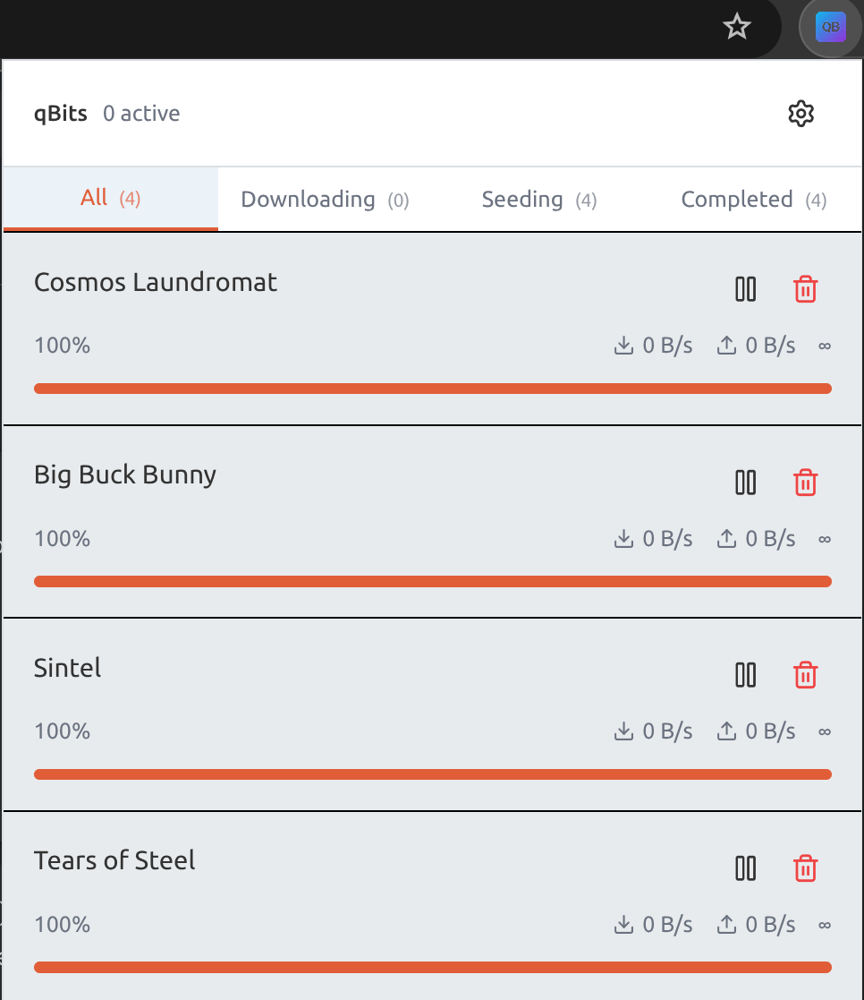

# qBits

A browser extension to monitor and manage your qBittorrent server.

## Features

- 📊 Monitor123 active downloads from your browser toolbar
- ➕ Add torrents via right-click context menu
- 🔔 Badge notifications for download counts
- 🌙 Dark mode support
- 🔒 Secure - connects only to your own server

## Installation

- [Chrome Web Store](https://chromewebstore.google.com/detail/qbits/lgeaklnlmfgcjppcigjjbpkfpbpgghaf)
- [Firefox Add-ons](https://addons.mozilla.org/en-US/firefox/addon/qbits/)

## Links

- [Privacy Policy](privacy)
- [Source Code](https://github.com/fergalmoran/qbits)
- [Report an Issue](https://github.com/fergalmoran/qbits/issues)

## License

This software is released into the public domain under [The Unlicense](https://unlicense.org). See [LICENSE.md](https://github.com/fergalmoran/qbits/blob/develop/LICENSE.md) for details.
